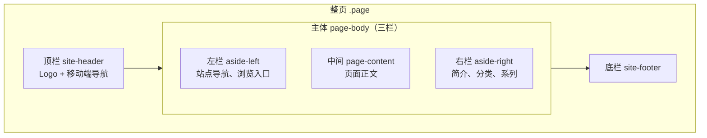

# 博客页面布局

窄屏（&lt; 1100px）时只显示顶栏 + 中间 + 底栏，左右栏隐藏，导航移到顶栏。

## 开关

在 `config/site.ts` 的 `layout` 中：

| 配置 | 说明 |
|------|------|
| `showLeftAside` | 是否显示左栏 |
| `showRightAside` | 是否显示右栏 |
| `rightTagCount` | 右栏显示几个分类 |
| `rightSeriesCount` | 右栏显示几个系列 |

宽度在 `styles/theme.css`：`--shell-max`、`--aside-left-width`、`--aside-right-width`。
