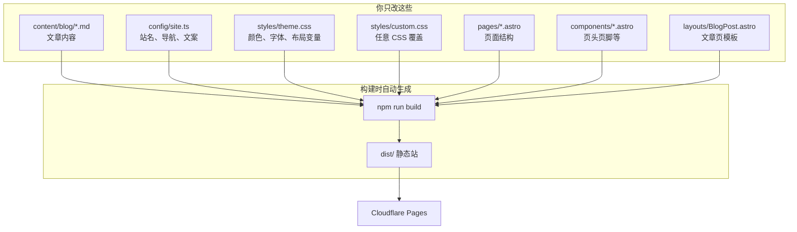

# 博客自定义结构

## 自定义程度

| 目标 | 改哪里 |
|------|--------|
| 换配色 / 字体 | `theme.css` |
| 改站名、菜单、首页文案 | `config/site.ts` |
| 横向分类（标签） | 文章 `tags: [...]` → `/tags/` |
| 有顺序的系列 | 文章 `series` + `seriesOrder` → `/series/` |
| 首页长什么样 | `pages/index.astro`（可整页重写） |
| 文章列表样式 | `pages/blog/index.astro` + `PostCard.astro` |
| 单篇文章版式 | `layouts/BlogPost.astro` |
| 写文章 | `content/blog/{文件夹}/*.md` |
| 完全自己的 CSS | `custom.css` |
